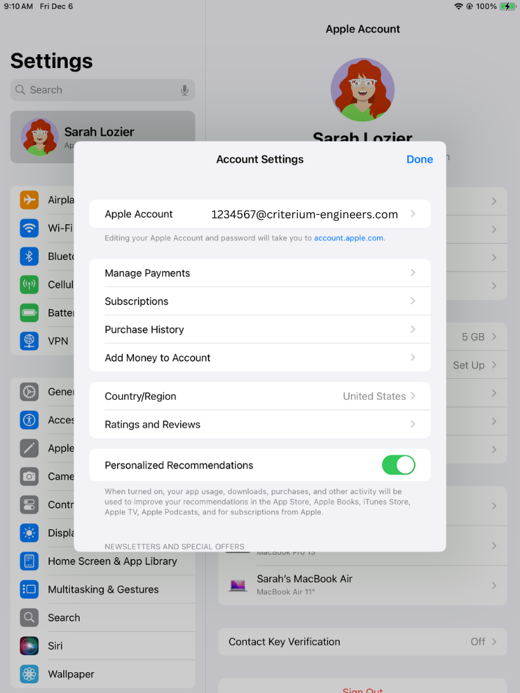
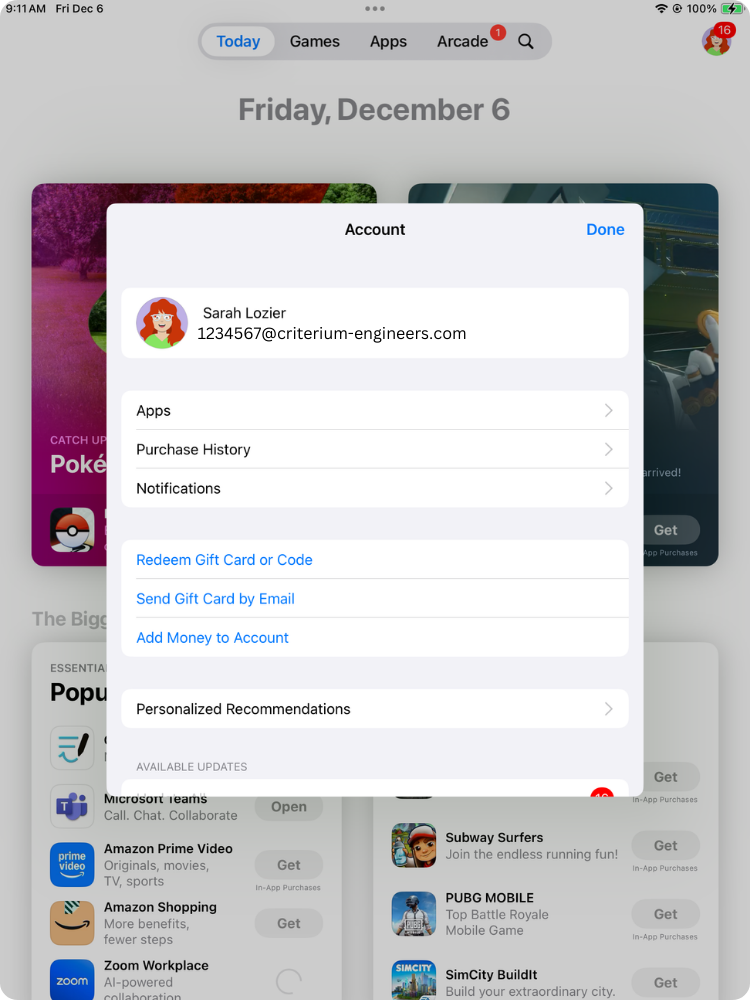
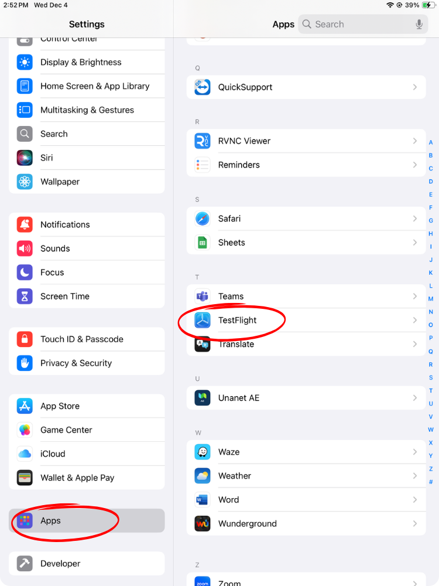
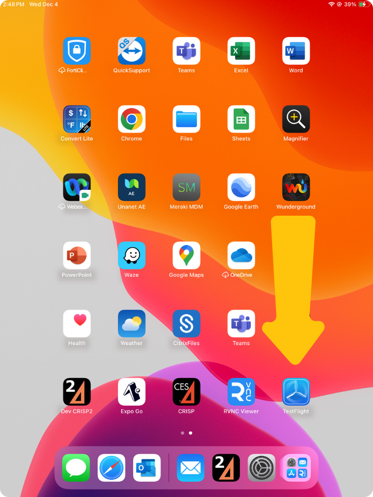
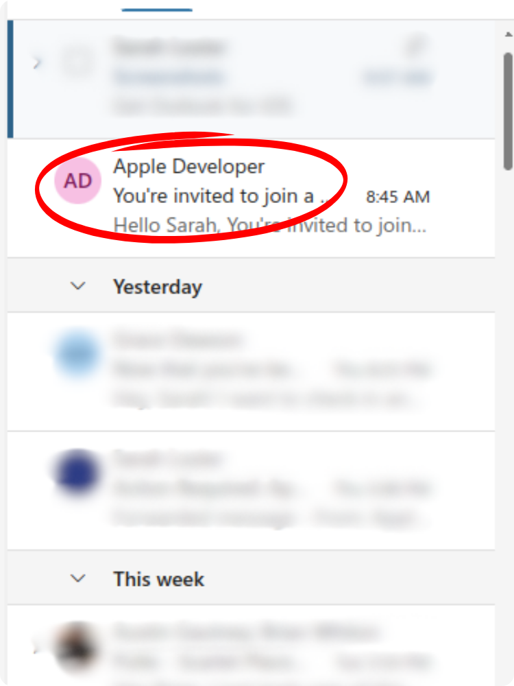
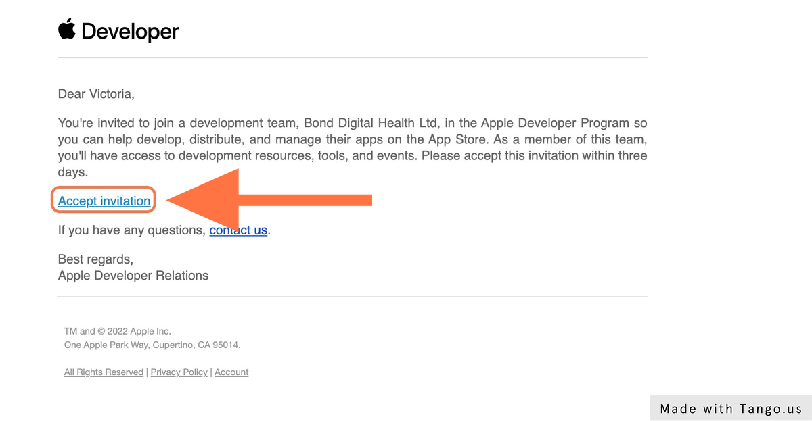
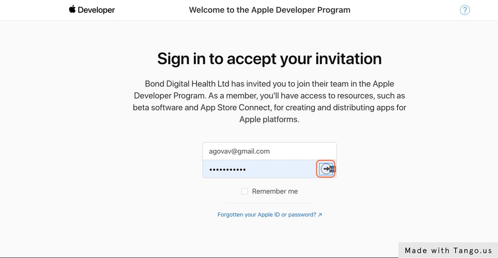
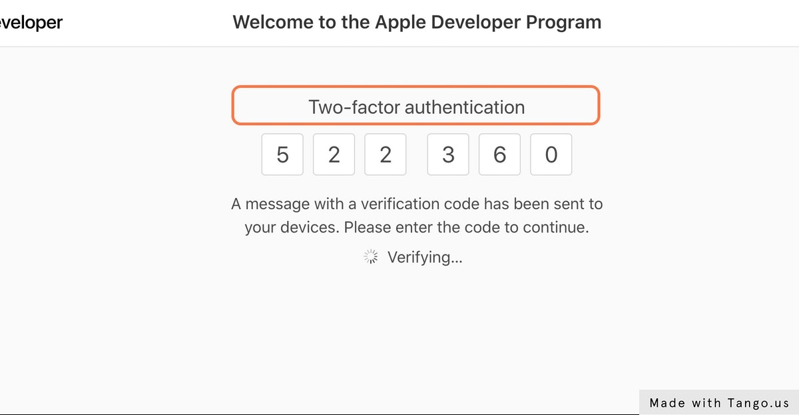
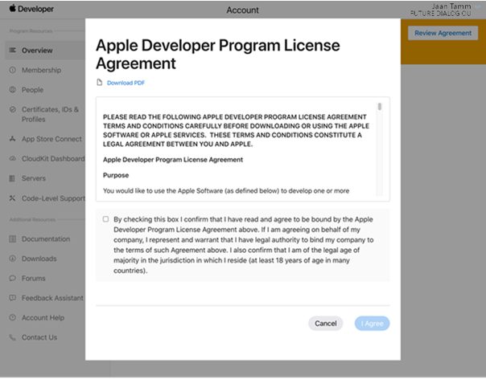

# Tester Instructions

Below is the checklist for verifying and setting up your iPad to test the CRISP Mobile application:

---

## Tester Checklist

### 1. Verify the Apple ID

- Go to **Settings** on the iPad. Confirm that the **Apple ID** matches the one assigned to you.

  

  
<b>See Screenshots</b>

  

  

- Ensure the **iTunes Apple ID** matches the one assigned to you.

  

  
<b>See Screenshots</b>

  

  

  
---

### 2. Report Mismatched Apple IDs

- If the Apple ID does not match the one assigned to you:

  - Send an email to:

    - **To**: [Derek](mailto:dbrown@criterium-engineers.com)
    - **CC**: [Sarah](mailto:slozier@criterium-engineers.com)
    - **CC**: [Deb](mailto:dadams@criterium-engineers.com)

  - Include the Apple ID(s) that appear on the:
  
    - iPad
    - iTunes

---

### 3. Check for TestFlight Installation

- Go to **Settings > Apps**.

  

  
<b>See Screenshots</b>

  

  

- Confirm that **TestFlight** is installed on the device.

  

  
<b>See Screenshots</b>

  

  

  
---

### 4. Install TestFlight (if needed)

- Open the **App Store** on the iPad.

- Search for and download **TestFlight**.

  

  
<b>See Screenshots</b>

  

  

---

### 5. Check Criterium-Engineers Email for Apple Developer Invitation

- Open your **Outlook** account on any device.
- Look for an email from **Apple Developer**.

  

  
<b>See Screenshots</b>

  

  

- If found:
  - Open the email and click **Accept Invitation**.

  

  
<b>See Screenshots</b>

  

  

  - Move to the next step.
- If there is no email, contact:
  - **To**: [Sarah](mailto:slozier@criterium-engineers.com)
  - **CC**: [Deb](mailto:dadams@criterium-engineers.com)
  - **CC**: [Austin](mailto:agautney@criterium-engineers.com)

---

### 6. Follow the Prompts for Apple Developer

- Sign in to **Apple Developer** using your Apple ID.

  

  
<b>See Screenshots</b>

  

  

- Complete **two-factor authentication**.

  

  
<b>See Screenshots</b>

  

  

- If prompted, sign the **Apple Developer Agreement**.

  

  
<b>See Screenshots</b>

  

  

---

### 7. Confirm Completion

- When the task is complete, send an email to:
  - **To**: [Sarah](mailto:slozier@criterium-engineers.com)
  - **CC**: [Deb](mailto:dadams@criterium-engineers.com)
  - **CC**: [Austin](mailto:agautney@criterium-engineers.com)
- If there are any issues preventing completion, include details in the email.

---
